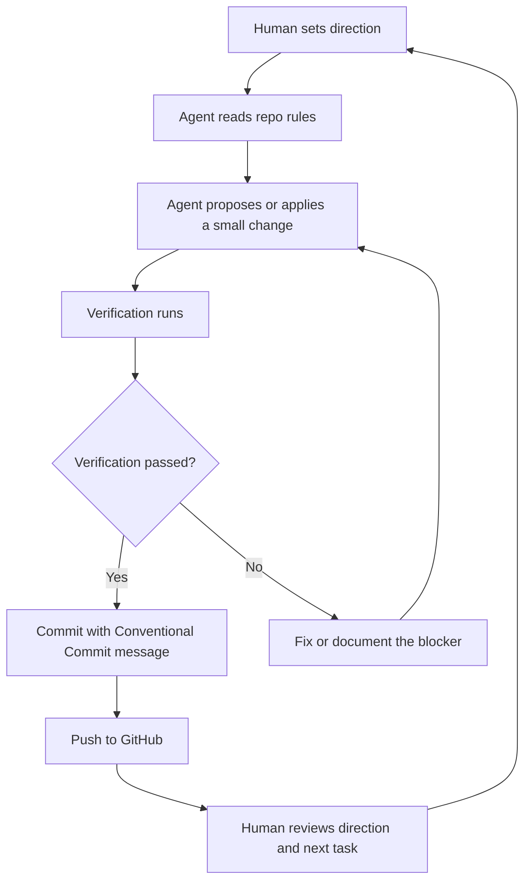
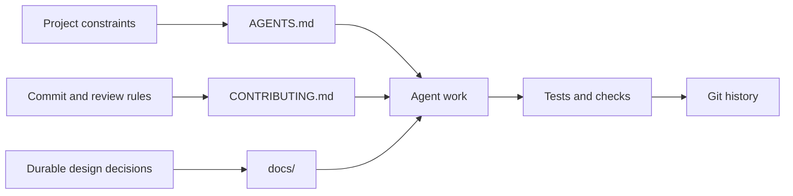

# Agentic Development Workflow

kafrust uses agent-assisted development, but the repository should remain readable to humans first. Agent instructions, commit rules, design notes, and roadmap decisions belong in git when they explain how the project is built. Private prompts, scratch plans, and transient chat notes do not.

## Goals

- Keep agent work reviewable.
- Preserve important project constraints in version control.
- Make protocol decisions traceable.
- Avoid turning the repository into a prompt log.

## Repository Boundary

Keep these files in git:

- `README.md`: project identity, status, and user-facing entry point
- `CONTRIBUTING.md`: contribution and commit rules
- `AGENTS.md`: stable instructions for coding agents
- `docs/`: durable architecture, workflow, and roadmap notes

Keep these out of git:

- private prompts
- temporary task notes
- chat transcripts
- local experiments that do not explain the project
- tool-specific cache or scratch directories

## Workflow



## Development Layers



## Commit Policy

Every commit should explain the project-level intent, not the tool that produced it. Prefer:

```text
docs: describe agentic development workflow
feat(protocol): encode request headers
test(protocol): cover nullable strings
```

Avoid:

```text
codex changes
agent update
misc
work in progress
```

## Decision Policy

Record decisions when they affect future implementation. Good candidates:

- Kafka protocol version support
- async runtime policy
- crate boundaries
- public API shape
- compatibility guarantees
- error handling strategy

Do not record every intermediate idea. If a note will not help a future contributor understand or change the project, keep it out of git.

## Current Operating Principle

The first implementation phase should favor correctness and auditability over API breadth. Build the protocol and connection layers in small steps, with tests that make wire behavior explicit.

## Fuzzing

The standalone [`fuzz/`](../fuzz/) workspace contains libFuzzer targets for
the public protocol decoders and all supported compression codecs. It is kept
outside the normal workspace so ordinary MSRV builds do not require nightly
Rust or libFuzzer.

Run a target locally with:

```text
cargo +nightly fuzz run frame
```

Malformed input is expected to return a typed error. A crash or sanitizer
finding must be reduced to a deterministic protocol regression test before
the fuzz target is considered healthy. The scheduled/manual `Fuzz Check`
workflow compiles every target and runs a bounded smoke campaign; long fuzz
campaigns remain a separate resource-bounded operation.
