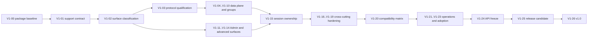

# kafrust v1.0 Milestone Program

This directory decomposes roadmap milestone M21 into small, evidence-backed
execution milestones. It is the planning source of truth for work from the
current `0.3.6` line through the `1.0.0` release. Historical implementation and
release evidence remains in [the roadmap](../../roadmap.md) and
[compatibility record](../../compatibility.md).

The target is a credible pure-Rust Kafka client for the broker profiles and
workloads that the project explicitly supports. It is not universal
`rust-rdkafka` parity, a Kafka broker, a Kafka Streams application engine, or a
promise that every Kafka API is stable at the high-level client boundary.

## Planning Baseline

The dated baseline and known contradictions are recorded in
[Planning Baseline](baseline.md). The important current facts are:

- planning date: 2026-08-21
- source baseline: `9eba7e5`
- branch state at inspection: clean `main`, synchronized with `origin/main`
- published crates: `kafrust 0.3.6` and `kafrust-protocol 0.3.6`
- exact baseline CI: passing run `32468949663`
- protocol audit: 63 modules and 76 unique Kafka API keys
- pinned schema audit: 12 high-risk schema identity/version/flexible-version
  metadata entries against Kafka 4.3.1
- historical package blocker: the source client package did not compile against
  the already-published `kafrust-protocol 0.3.5`; the coordinated `0.3.6`
  publication repaired that registry boundary

At the dated baseline, the package blocker made
[V1-00](v1-00-repository-and-package-baseline.md) the only valid first
implementation milestone. No later source capability should have been
published from that same-version package state.

## Current Execution

As of 2026-08-24, V1-00, V1-01, V1-02, and V1-19 are `Done`; V1-03 through
V1-18 and V1-20 through V1-22 remain `In progress`; V1-23
is `Blocked` on a named service canary; and V1-24 through V1-26 are `Planned`.
The coordinated
`0.3.6` pair is published and resolves from fresh external projects on Rust
1.81.0 and stable. The historical regression against published protocol
`0.3.5` was reproduced for the four missing transaction type families, then
closed by the protocol-first `0.3.6` package boundary recorded in
[`v1-20-published-0.3.6-boundary-2026-08-23.md`](../../evidence/v1-20-published-0.3.6-boundary-2026-08-23.md).
The exact pushed-head CI and published diagnostic runs remain the evidence
source for later gates; neither this publication nor those diagnostics claim
V1-20 completion or `1.0.0` readiness.

V1-02 has since generated the all-features public API snapshot at
[`docs/evidence/public-api-snapshot.json`](../../evidence/public-api-snapshot.json):
2,374 symbols, twelve public modules, and 288 root exports. CI checks its root
surface and public-declaration digest, while the V1-24 preparation manifest
locks the current counts and feature/toolchain policy. The final freeze remains
owned by V1-24.

V1-03's data-plane manifest and malformed-response boundary tests, V1-04's
typed delivery-deadline contract, and V1-05's deterministic idempotent retry
slice are recorded in their milestone documents. V1-06 records the coherent
TV1 transaction decision and commit/abort ambiguity tests. V1-07 records direct
consumer integrity increments, and V1-08 records the exact-identity typed
OffsetCommit ambiguity contract. V1-09 records KIP-848 epoch/member-ID and
UUID/regex recovery increments. V1-10 records Share acknowledgement/session
and redelivery increments. V1-11 records common controller mutation routing
and ambiguity increments. V1-12 records coordinator/leader routing, V1-13
records security Admin handling, and V1-14 records advanced-surface
classification. V1-15 records the current owner/task/session audit, V1-16 the
credential and redaction slice, V1-17 the bounded metrics/telemetry contract,
V1-18 the decoder/resource-limit and fuzz baseline, V1-19 the staged
pure-Rust package boundary, and V1-20 the checked draft compatibility matrix.
V1-21 through V1-26 have preparation records that preserve the long-soak,
SLO, migration, freeze, RC, and stable-publication prerequisites. The `0.3.6`
publication is a bounded pre-1.0 package boundary only; it does not satisfy
the later fault, SLO, service-canary, API-freeze, RC, or stable-release gates.
These remain implementation and qualification increments, not
`1.0.0`-readiness claims.
The V1-25 and V1-26 release manifests and checkers now lock the coordinated
version identities, protocol-first publication order, exact RC dependency,
metadata-only stable diff, and explicit authorization boundary; both remain
preparation inputs until their external evidence exists.

The pushed documentation refresh `4a2b472` passed both stable and Rust 1.81.0
CI. A fresh capacity audit recorded in
[`v1-long-campaign-capacity-audit-2026-08-24.md`](../../evidence/v1-long-campaign-capacity-audit-2026-08-24.md)
found zero registered self-hosted runners and no local Docker substitute, so
the V1-21 six-hour and V1-22 eight-hour gates remain explicitly unqualified.

## Status And Evidence

Work status and evidence level are separate axes.

Work status:

- `Planned`: scoped but not started.
- `In progress`: implementation or qualification is active.
- `Blocked`: an explicit external or prerequisite gate prevents progress.
- `Done`: every exit criterion in the milestone document has passed.
- `Superseded`: replaced by a linked decision or milestone whose mapped exit
  criteria and evidence are themselves complete; it is never a shortcut around
  unfinished work.

Evidence level:

- `Design`: scope and contracts only.
- `Local deterministic`: focused unit, protocol, or scripted-broker evidence.
- `CI`: required repository checks passed on an exact pushed commit.
- `Live current-source`: a named live broker profile passed from that commit.
- `Packaged candidate`: tarballs were built and verified without workspace
  path dependencies.
- `Published artifact`: a fresh external project resolved the exact registry
  artifact and passed the stated profile.
- `Service canary`: a representative service passed migration, fault, and
  rollback gates.

`Done` does not imply the highest evidence level. Each milestone declares one
unconditional base evidence rung; all lower applicable rungs, explicit numeric
gates, and any higher conditional evidence named by that milestone still apply.
Target evidence must use exactly one label from the list above. An exclusion is
a classified outcome enforced at CI, not an evidence level. M21 is not done
until V1-26 is complete.

## Readiness Model

Percentages are planning estimates, never completion claims. The existing
strategy ranges are re-baselined with one explicit model:

| Dimension | Weight | 2026-08-21 estimate | Weighted contribution |
| --- | ---: | ---: | ---: |
| Protocol and API breadth | 25% | 75-85% | 18.75-21.25% |
| High-level runtime semantics | 40% | 45-55% | 18-22% |
| Production evidence and release maturity | 35% | 35-45% | 12.25-15.75% |
| **Weighted readiness band** | **100%** |  | **49-59%** |

The band is intentionally close to the earlier 50-60% estimate. It prevents
the 75-85% protocol count from being presented as replacement readiness.
Milestones advance by binary exit gates, not by manually incrementing this
percentage. Recalculate the band only when source and evidence inventories are
updated together.

## Candidate v1 Support Matrix

This is a planning matrix, not a compatibility claim. V1-01 must accept,
change, or explicitly reject every row before implementation milestones use
it as a release gate.

| Role | Exact broker line | Planned use |
| --- | --- | --- |
| Floor probes | 3.3.2 and 3.6.2 | Decide whether to support them or document 3.7.2 as the v1 floor. |
| Proposed floor | 3.7.2 | Full classic-group, core data-plane, Admin, security, and compatibility qualification. |
| Continuity | 3.8.1 | Detect regressions between the floor and later protocol transitions. |
| Pre-4.x current | 3.9.1 | Core data-plane and modern Admin compatibility. |
| 4.x transition | 4.0.0 | Qualify core client behavior; do not use removed early-access Share schemas. |
| Pinned current | 4.3.1 | KIP-848, stable KIP-932 Share, Streams membership, modern Admin, and KRaft qualification. |

The matrix is pairwise, not a full Cartesian product. At minimum, plaintext
core profiles run on every accepted broker line; TLS, SASL/PLAIN,
SASL_SSL/SCRAM-SHA-256, SCRAM-SHA-512, mTLS, and signed OAUTHBEARER run on the
accepted floor and pinned-current lines where the mechanism exists. Classic
groups are required at the accepted floor. KIP-848 and stable Share profiles
are required on the pinned 4.x line. V1-01 owns the final topology and security
table.

## Program Map

All milestones are `Planned` at creation. Existing evidence is an input, not a
reason to pre-close a newly defined exit gate.

| ID | Milestone | Depends on | Base terminal evidence |
| --- | --- | --- | --- |
| V1-00 | [Repository and package baseline](v1-00-repository-and-package-baseline.md) | none | Packaged candidate |
| V1-01 | [Support contract and evidence ledger](v1-01-support-contract-and-evidence-ledger.md) | V1-00 | CI |
| V1-02 | [Public surface classification](v1-02-public-surface-classification.md) | V1-01 | CI |
| V1-03 | [Data-plane protocol qualification](v1-03-data-plane-protocol-qualification.md) | V1-02 | Live current-source |
| V1-04 | [Producer delivery deadline](v1-04-producer-delivery-deadline.md) | V1-03 | Published artifact |
| V1-05 | [Idempotent producer fault matrix](v1-05-idempotent-producer-fault-matrix.md) | V1-04 | Published artifact |
| V1-06 | [Transaction outcome safety](v1-06-transaction-outcome-safety.md) | V1-05 | Published artifact |
| V1-07 | [Direct consumer integrity](v1-07-direct-consumer-integrity.md) | V1-03 | Published artifact |
| V1-08 | [Classic group lifecycle](v1-08-classic-group-lifecycle.md) | V1-07 | Published artifact |
| V1-09 | [KIP-848 group lifecycle](v1-09-kip848-group-lifecycle.md) | V1-07 | Published artifact |
| V1-10 | [ShareConsumer contract](v1-10-share-consumer-contract.md) | V1-07, V1-09 | Published artifact |
| V1-11 | [Controller-routed Admin mutations](v1-11-controller-admin-mutations.md) | V1-02 | Published artifact |
| V1-12 | [Coordinator and leader Admin mutations](v1-12-coordinator-leader-admin-mutations.md) | V1-02 | Published artifact |
| V1-13 | [Bootstrap and security Admin mutations](v1-13-bootstrap-security-admin-mutations.md) | V1-02, V1-11 | Published artifact |
| V1-14 | [Advanced protocol surfaces](v1-14-advanced-protocol-surfaces.md) | V1-02, V1-11 | CI |
| V1-15 | [Session ownership and shutdown](v1-15-session-ownership-and-shutdown.md) | V1-04-V1-14 | Published artifact |
| V1-16 | [Security and credential lifecycle](v1-16-security-credential-lifecycle.md) | V1-15 | Published artifact |
| V1-17 | [Telemetry and metrics contract](v1-17-telemetry-and-metrics-contract.md) | V1-02, V1-15 | Published artifact |
| V1-18 | [Resource limits and fuzzing](v1-18-resource-limits-and-fuzzing.md) | V1-03, V1-15 | CI |
| V1-19 | [Pure-Rust dependency audit](v1-19-pure-rust-dependency-audit.md) | V1-02 | Packaged candidate |
| V1-20 | [Published compatibility matrix](v1-20-published-compatibility-matrix.md) | V1-03-V1-19 | Published artifact |
| V1-21 | [Fault soak and data-loss semantics](v1-21-fault-soak-and-data-loss.md) | V1-15, V1-16, V1-18, V1-20 | Published artifact |
| V1-22 | [Performance and operational SLOs](v1-22-performance-and-operational-slos.md) | V1-18, V1-20, V1-21 | Published artifact |
| V1-23 | [Migration adapter and rollback](v1-23-migration-adapter-and-rollback.md) | V1-04-V1-17 | Service canary |
| V1-24 | [Public API freeze](v1-24-public-api-freeze.md) | V1-20-V1-23 | Packaged candidate |
| V1-25 | [Release candidate](v1-25-release-candidate.md) | V1-24 | Service canary |
| V1-26 | [v1.0 release](v1-26-v1-release.md) | V1-25 | Service canary |

Milestone IDs are not crate versions. A milestone may require more than one
pre-1.0 release, and several milestones may ship together. Only V1-25 and
V1-26 prescribe semver release identities. Dependency edges order contracts
and deterministic implementation, not one publication per milestone; V1-20
may supply the shared published-artifact evidence that closes several already
implemented milestones on one candidate.

## Dependency Shape

V1-03 through V1-19 may proceed in parallel only where their dependency lists
permit it. V1-20 is the convergence point: it reruns the accepted matrix with
the same candidate rather than combining evidence from unrelated commits.

## Program Exit Definition

M21 and this program are complete only when all of the following are true:

1. Every V1-00 through V1-26 milestone is `Done`, or is `Superseded` by a linked
   completed decision/milestone that maps and satisfies every inherited exit
   criterion and evidence gate.
2. Every public capability is classified as stable, expert/experimental, or
   excluded, and the classification matches the actual crate exports.
3. Every stable operation has explicit pre-transmission, post-transmission,
   retry, timeout, cancellation, shutdown, and reconciliation semantics.
4. The accepted broker/security/topology matrix passes from the same release
   candidate, with current-source and fresh external artifact evidence kept
   separate.
5. Resource, malformed-input, fault, soak, and performance gates meet their
   recorded thresholds with zero unaccounted acknowledged loss outside declared
   broker-loss fixtures and no hidden duplicates.
6. A representative migration canary can deploy, observe, and roll back
   without rewriting business logic.
7. Public API, MSRV, features, defaults, errors, deprecation policy, and the
   `kafrust`/`kafrust-protocol` semver relationship are frozen.
8. Protocol-first `1.0.0` publication, docs.rs, external-project smoke, GitHub
   release, and post-publish qualification all pass on the exact tagged source.

These gates authorize a claim only for documented supported profiles. They do
not authorize “production-ready everywhere,” Kafka broker replacement, or
complete Kafka Streams compatibility.

## How To Execute A Milestone

Use [Execution Rules](execution-rules.md) and copy [_template.md](_template.md)
when a milestone needs to be refined. One task should own one coherent work
package or one evidence gate. Do not mark a milestone done merely because its
code exists; record the exact evidence required by that milestone.
